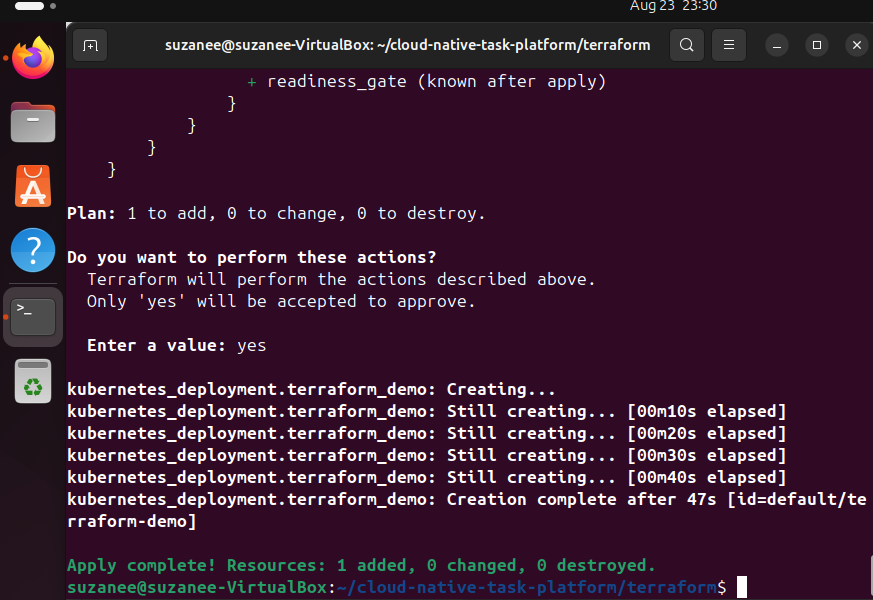
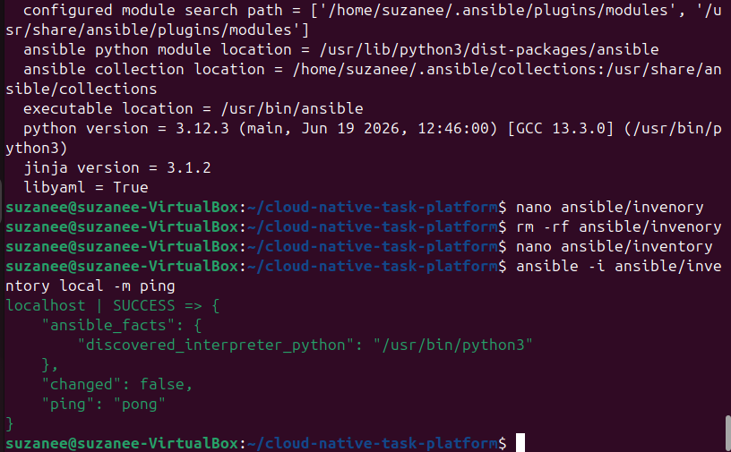
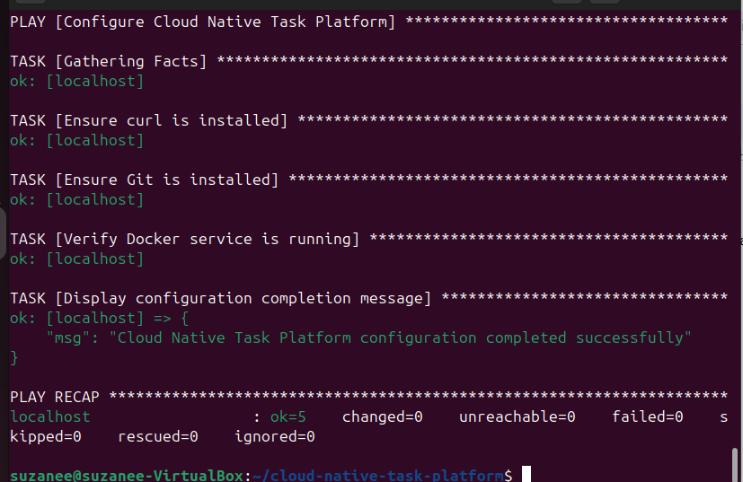
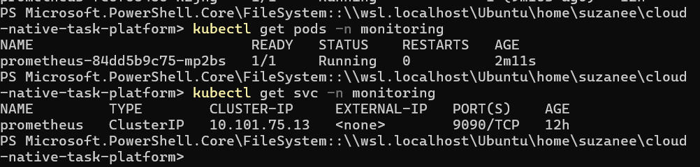
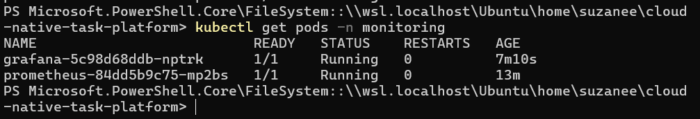
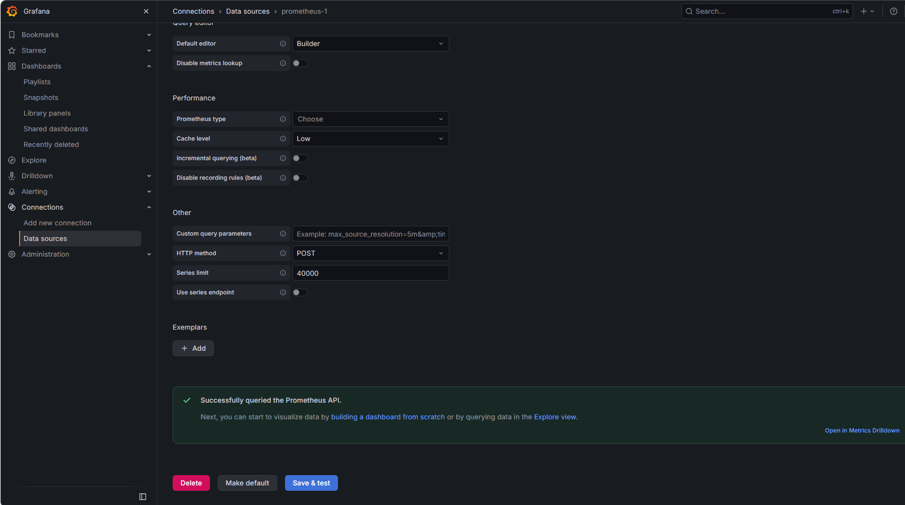
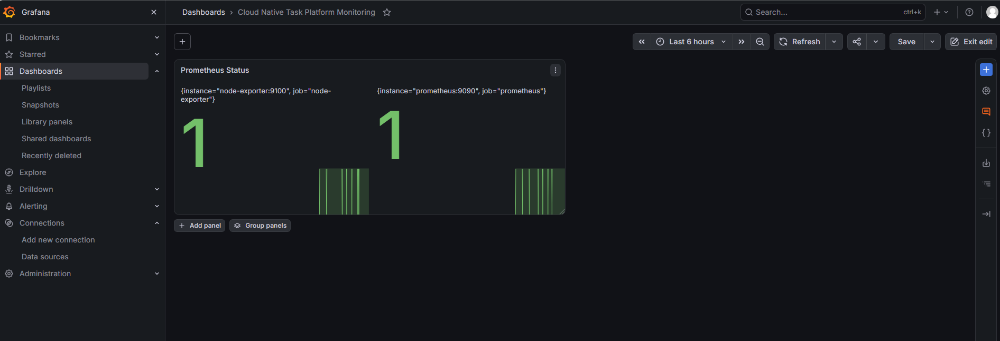
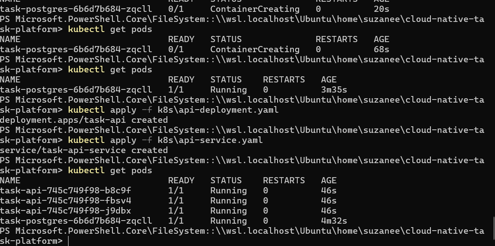

# Cloud Native Task Platform

## Project Overview

Cloud Native Task Platform is a cloud-native task management application developed to demonstrate modern DevOps, containerization, orchestration, automation, CI/CD, Infrastructure as Code, and monitoring practices.

The application provides a simple and colorful web interface and REST API for creating, viewing, updating, and deleting tasks.

The project uses Flask as the backend framework and PostgreSQL as the database. The application is containerized using Docker and deployed locally using Kubernetes through Minikube.

Prometheus is used for monitoring and Grafana is used to visualize monitoring data.

This project was developed and tested in a local Linux environment. It was not deployed to AWS, Azure, Google Cloud, or another public cloud platform.

## Project Objectives

- Develop a task management application using Flask
- Create a simple and colorful web interface
- Implement REST API endpoints
- Store task information in PostgreSQL
- Containerize the application using Docker
- Deploy the application using Kubernetes
- Use Minikube as the local Kubernetes environment
- Implement CI/CD using GitHub Actions
- Demonstrate Infrastructure as Code using Terraform
- Demonstrate configuration management using Ansible
- Monitor the application using Prometheus
- Visualize monitoring metrics using Grafana

## Technology Stack

| Category | Technology |
|---|---|
| Programming Language | Python |
| Backend Framework | Flask |
| ORM | Flask-SQLAlchemy |
| Frontend | HTML, CSS, JavaScript |
| Database | PostgreSQL |
| Containerization | Docker |
| Container Orchestration | Kubernetes |
| Local Kubernetes | Minikube |
| CI/CD | GitHub Actions |
| Infrastructure as Code | Terraform |
| Configuration Management | Ansible |
| Monitoring | Prometheus |
| Visualization | Grafana |
| Operating System | Ubuntu Linux |
| Version Control | Git and GitHub |

# System Architecture

```text
                         User
                           |
                           v
                    Web Browser
                           |
                           v
                Flask Task Application
                   /               \
                  /                 \
                 v                   v
        Web Interface            REST API
                                      |
                                      v
                              Flask-SQLAlchemy
                                      |
                                      v
                                 PostgreSQL
                                      |
                                      v
                               Kubernetes
                                      |
                                   Minikube
                                      |
                       +--------------+--------------+
                       |                             |
                       v                             v
                  Prometheus                     Grafana
                       |                             |
                       +-------------+---------------+
                                     |
                                     v
                            Monitoring Dashboard
```

# Project Structure

```text
cloud-native-task-platform/
│
├── .github/
│   └── workflows/
│       └── ci.yml
│
├── ansible/
│   └── playbook.yml
│
├── backend/
│   ├── app.py
│   ├── requirements.txt
│   │
│   ├── static/
│   │   └── style.css
│   │
│   └── templates/
│       └── index.html
│
├── k8s/
│   ├── api-deployment.yaml
│   ├── api-service.yaml
│   └── postgres-deployment.yaml
│
├── monitoring/
│   ├── prometheus.yaml
│   └── grafana.yaml
│
├── terraform/
│
├── screenshots/
│
├── Dockerfile
├── docker-compose.yml
└── README.md
```

# 1. Application

## Application Features

The Task Platform provides:

- Create tasks
- View tasks
- Update tasks
- Change task status
- Delete tasks
- Health check endpoint
- PostgreSQL database integration
- Web-based task interface
- REST API
- Docker deployment
- Kubernetes deployment
- Prometheus monitoring
- Grafana dashboard

# 2. Web Interface

The project includes a simple and colorful web interface for managing tasks.

The frontend files are:

```text
backend/templates/index.html
backend/static/style.css
```

The interface communicates with the Flask backend.

```text
Web Browser
     |
     v
HTML + CSS Interface
     |
     v
Flask REST API
     |
     v
SQLAlchemy
     |
     v
PostgreSQL
```

# 3. REST API

## Health Check

```http
GET /health
```

Example response:

```json
{
  "status": "healthy"
}
```

## Get All Tasks

```http
GET /tasks
```

Example response:

```json
[
  {
    "id": 1,
    "title": "Complete Cloud Native Project",
    "status": "pending"
  }
]
```

## Create a Task

```http
POST /tasks
Content-Type: application/json
```

Example request:

```json
{
  "title": "Complete Cloud Native Project",
  "status": "pending"
}
```

Example response:

```json
{
  "id": 1,
  "title": "Complete Cloud Native Project",
  "status": "pending"
}
```

## Update a Task

```http
PUT /tasks/<task_id>
Content-Type: application/json
```

Example request:

```json
{
  "status": "completed"
}
```

## Delete a Task

```http
DELETE /tasks/<task_id>
```

Example response:

```json
{
  "message": "Task deleted successfully"
}
```

# 4. Local Development

## Development Environment

The project was developed and tested using:

```text
Operating System: Ubuntu Linux
Container Runtime: Docker
Kubernetes: Kubernetes
Local Kubernetes Platform: Minikube
```

The application was developed in a Linux environment and tested locally.

## Clone Repository

```bash
git clone https://github.com/Zaffraj-Suzanee/cloud-native-task-platform.git
```

Navigate to the project:

```bash
cd cloud-native-task-platform
```

## Install Python Dependencies

Navigate to the backend:

```bash
cd backend
```

Install dependencies:

```bash
pip install -r requirements.txt
```

# 5. Run Flask Application

```bash
python app.py
```

The application runs on:

```text
http://localhost:5000
```

The web interface can be opened in a browser using the local application URL.

# 6. Docker

Docker is used to containerize the Flask application.

## Build Docker Image

From the project root:

```bash
docker build -t cloud-native-task-platform-api:latest .
```

## Run Docker Container

```bash
docker run -p 5000:5000 cloud-native-task-platform-api:latest
```

The application can then be accessed at:

```text
http://localhost:5000
```

# 7. Docker Compose

Docker Compose is used to run the application and PostgreSQL together.

Start the services:

```bash
docker compose up -d
```

Check services:

```bash
docker compose ps
```

View logs:

```bash
docker compose logs
```

Stop the services:

```bash
docker compose down
```

# 8. Kubernetes

Kubernetes is used to orchestrate the application and database.

The Kubernetes manifests are located in:

```text
k8s/
```

The Kubernetes environment contains:

```text
Task API
PostgreSQL
Task API Service
PostgreSQL Service
```

# 9. Minikube

## Why Minikube?

This project was not deployed to a public cloud.

Minikube was used to create and manage a local Kubernetes cluster.

Minikube provides a lightweight Kubernetes environment suitable for:

- Development
- Testing
- Learning Kubernetes
- Local deployment
- Monitoring demonstrations

## Start Minikube

```bash
minikube start
```

## Check Minikube Status

```bash
minikube status
```

Expected components include:

```text
host: Running
kubelet: Running
apiserver: Running
kubeconfig: Configured
```

## Check Kubernetes Cluster

```bash
kubectl cluster-info
```

## Check Kubernetes Nodes

```bash
kubectl get nodes
```

# 10. Deploy Application to Kubernetes

Apply the Kubernetes manifests:

```bash
kubectl apply -f k8s/
```

Check all Kubernetes resources:

```bash
kubectl get all
```

Check pods:

```bash
kubectl get pods
```

Check services:

```bash
kubectl get svc
```

## Task API Deployment

The Flask API is deployed using a Kubernetes Deployment.

Multiple replicas are configured to demonstrate Kubernetes scalability and availability.

Check deployments:

```bash
kubectl get deployments
```

Check Task API pods:

```bash
kubectl get pods
```

## PostgreSQL Deployment

PostgreSQL is deployed inside the local Kubernetes cluster.

The Flask application connects to PostgreSQL using the Kubernetes PostgreSQL service.

The application uses the following architecture:

```text
Flask API
    |
    v
SQLAlchemy
    |
    v
PostgreSQL Service
    |
    v
PostgreSQL Pod
```

# 11. Access Application Using Minikube

The Task API is exposed using a Kubernetes Service.

Get the service URL:

```bash
minikube service task-api-service --url
```

Open the returned URL in a web browser.

# 12. PostgreSQL Verification

Check PostgreSQL:

```bash
kubectl get pods
```

Check PostgreSQL logs:

```bash
kubectl logs deployment/task-postgres
```

The application uses PostgreSQL when running inside the Kubernetes environment.

Task data created through the Kubernetes-deployed application is stored in PostgreSQL through the configured `DATABASE_URL`.

# 13. GitHub Actions CI/CD

GitHub Actions is used to automate the CI/CD workflow.

The workflow file is:

```text
.github/workflows/ci.yml
```

The workflow demonstrates:

```text
Developer
    |
    v
Git Push
    |
    v
GitHub Repository
    |
    v
GitHub Actions
    |
    v
Checkout Source Code
    |
    v
Install Dependencies
    |
    v
Run Tests
    |
    v
Build Docker Image
```

GitHub Actions provides automated CI/CD for the project repository.

The Kubernetes cluster itself is local and runs using Minikube.

# 14. Terraform

Terraform is included to demonstrate Infrastructure as Code.

Terraform files are located in:

```text
terraform/
```

## Initialize Terraform

```bash
terraform init
```

## Validate Terraform

```bash
terraform validate
```

## Terraform Plan

```bash
terraform plan
```

Terraform provides a declarative approach for defining infrastructure.

# 15. Ansible

Ansible is used to demonstrate configuration management and automation.

The playbook is located at:

```text
ansible/playbook.yml
```

## Run Ansible

```bash
ansible-playbook -i inventory ansible/playbook.yml
```

A successful execution should show:

```text
failed=0
```

# 16. Prometheus

Prometheus is used for monitoring.

The Prometheus Kubernetes configuration is:

```text
monitoring/prometheus.yaml
```

## Create Monitoring Namespace

```bash
kubectl create namespace monitoring
```

If the namespace already exists, it can be reused.

## Deploy Prometheus

```bash
kubectl apply -f monitoring/prometheus.yaml
```

## Check Prometheus

```bash
kubectl get pods -n monitoring
```

Expected:

```text
prometheus-xxxxx    1/1    Running
```

## Check Prometheus Service

```bash
kubectl get svc -n monitoring
```

Prometheus uses:

```text
Port: 9090
```

# 17. Grafana

Grafana is used to visualize Prometheus monitoring information.

The Grafana Kubernetes configuration is:

```text
monitoring/grafana.yaml
```

## Deploy Grafana

```bash
kubectl apply -f monitoring/grafana.yaml
```

## Check Grafana

```bash
kubectl get pods -n monitoring
```

Expected:

```text
prometheus-xxxxx    1/1    Running
grafana-xxxxx       1/1    Running
```

## Access Grafana

Use Minikube:

```bash
minikube service grafana -n monitoring --url
```

Open the generated URL in a browser.

## Grafana Login

```text
Username: admin
Password: admin123
```

# 18. Grafana and Prometheus

Grafana was configured to use Prometheus as the data source.

The Prometheus data source was successfully tested in Grafana.

Grafana displayed:

```text
Successfully queried the Prometheus API.
```

This confirms that Grafana can successfully communicate with Prometheus.

# 19. Grafana Dashboard

A Grafana dashboard was created with the name:

```text
Cloud Native Task Platform Monitoring
```

The Prometheus query used was:

```promql
up
```

The query returned:

```text
1
```

A value of `1` indicates that the monitored target is available.

# 20. Monitoring Architecture

```text
                  Kubernetes / Minikube
                           |
                           v
                      Flask API
                           |
                           v
                       Prometheus
                           |
                           v
                         Grafana
                           |
                           v
                  Monitoring Dashboard
```

# 21. Complete DevOps Workflow

```text
                    Developer
                        |
                        v
                 GitHub Repository
                        |
                        v
                 GitHub Actions
                        |
                        v
                  Docker Image
                        |
                        v
                    Kubernetes
                        |
                        v
                     Minikube
                        |
              +---------+---------+
              |                   |
              v                   v
          Flask API           PostgreSQL
              |
              v
          Prometheus
              |
              v
           Grafana
              |
              v
      Monitoring Dashboard
```


# 22. Screenshots

The following screenshots demonstrate the implementation, deployment, automation, and monitoring stages of the project.

<table>
<tr>
<td width="25%">



</td>

<td width="25%">



</td>

<td width="25%">



</td>

<td width="25%">



</td>
</tr>

<tr>
<td width="25%">



</td>

<td width="25%">



</td>

<td width="25%">



</td>

<td width="25%">



</td>
</tr>
</table>

# 23. Deployment Environment

This project was developed and deployed locally.

It was not deployed to a public cloud provider.

The deployment environment was:

```text
Windows Host
      |
      v
Ubuntu Linux
      |
      v
Docker
      |
      v
Minikube
      |
      v
Kubernetes
      |
      +----------------------+
      |                      |
      v                      v
   Flask API             PostgreSQL
      |
      v
 Prometheus
      |
      v
   Grafana
```

The Kubernetes cluster was created using Minikube on Linux.

Therefore, this project should be considered a local cloud-native deployment and demonstration rather than a public cloud deployment.

# 24. Limitations

The current implementation is mainly designed for educational and demonstration purposes.

The Kubernetes cluster runs locally using Minikube.

There is no public production URL.

The project does not currently use a managed cloud Kubernetes service.

The project does not currently use a managed cloud database.

# 25. Conclusion

Cloud Native Task Platform demonstrates the transformation of a Flask task management application into a cloud-native application using modern DevOps technologies.

The application was successfully developed and tested in a local Ubuntu Linux environment using Minikube.

The project demonstrates application development, containerization, Kubernetes orchestration, CI/CD, infrastructure automation, configuration management, monitoring, and visualization.

The final system provides a simple task management interface together with REST APIs, PostgreSQL persistence, Kubernetes deployment, Prometheus monitoring, and Grafana visualization.
